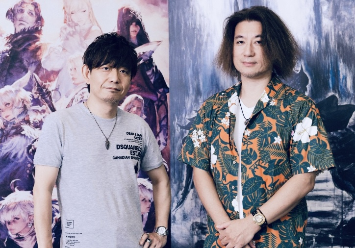

{:toc}

# Yasumi Matsuno
Yasumi Matsuno est un développeur de jeux vidéo japonais renommé, né le 24 octobre 1965 à Matsusaka, dans la préfecture de Mie. Son parcours est marqué par une passion pour la narration complexe et les systèmes de jeu profonds, ce qui l’a amené à devenir une figure influente dans l’industrie du jeu vidéo.

> Yasumi Matsuno et Naoki Yoshida en 2021 dans un interview pour [Famitsu](https://www.famitsu.com/news/202109/27234807.html). 

Dès son jeune âge, Matsuno s’intéresse à la fois aux jeux vidéo et aux jeux de rôle sur table. Après avoir obtenu son diplôme de l’Université Waseda, il commence sa carrière chez Quest Corporation en 1989. Là, il travaille sur plusieurs projets mineurs avant de concevoir son premier grand succès, “Ogre Battle: The March of the Black Queen” en 1993. Ce jeu de stratégie a été acclamé pour son gameplay innovant et son histoire riche, posant les bases du style de Matsuno.

En 1995, Matsuno crée “Tactics Ogre: Let Us Cling Together”, un jeu qui est souvent cité comme l’un des meilleurs jeux de rôle tactiques jamais réalisés. Son succès critique et commercial attire l’attention de Square (aujourd’hui Square Enix), qui embauche Matsuno en 1995. Chez Square, Matsuno est d’abord assigné au projet “Final Fantasy Tactics” sorti en 1997. Le jeu révolutionne le genre avec ses mécaniques de jeu profondes et son intrigue mature et complexe.

En 2000, Matsuno dirige “Vagrant Story”, un jeu de rôle d’action qui obtient également des éloges pour son récit intrigant et son système de combat unique. Cependant, c’est avec “Final Fantasy XII” qu’il atteint un nouveau sommet de sa carrière. Annoncé en 2001, le jeu sort finalement en 2006 après un développement prolongé et tumultueux. Bien que Matsuno ait quitté le projet avant son achèvement en raison de problèmes de santé, son influence est palpable dans la conception ouverte du jeu et son approche narrative ambitieuse.

Après son départ de Square Enix, Matsuno travaille en freelance sur divers projets, y compris des collaborations avec des studios comme Level-5 pour le jeu “Crimson Shroud” en 2012. En 2016, il retourne dans l’univers de “Final Fantasy” en contribuant à des scénarios pour le MMORPG “Final Fantasy XIV”.

Yasumi Matsuno est connu pour son souci du détail, sa capacité à créer des mondes immersifs et des histoires engageantes. Sa carrière, marquée par des œuvres emblématiques telles que “Ogre Battle”, “Final Fantasy Tactics” et “Final Fantasy XII”, a laissé une empreinte indélébile sur l’industrie du jeu vidéo. À ce jour, Matsuno continue d’influencer le monde du jeu vidéo avec son approche unique et ses contributions créatives, restant une figure respectée et admirée par les fans et les développeurs du monde entier.

# Sakimoto (musique)
# Minagawa (direction artistique)
# Histoires de développement
# Interviews
